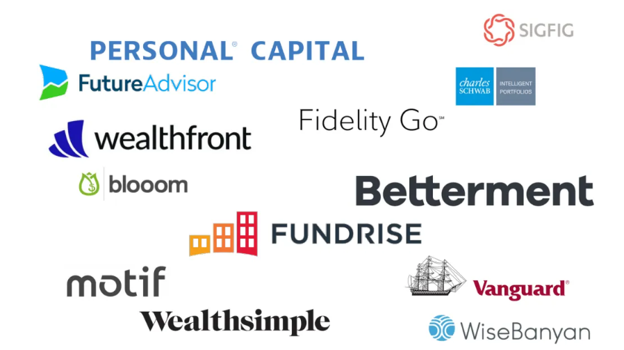

# Case Study - Wealthfront

(source - [Investopedia](https://www.investopedia.com/wealthfront-review-4587933))

---

## Overview and Origin

### What are Robo-Advisors?

Robo-advisor is a platform that provides algorithm based financial tools that are fully automated without human input. They collect information through a survery about risk level and financial goals to recommend and automatically invest assets in a diversified portfolio. (1)

Robo-advisors burst onto the scene during the 2008 financial crisis as a way to invest and save with low fees and zero starting balances with the goal of passive long term investing relying on a basket of ETF's to achieve a highly diversified portfolios. (2)

### Subject of Case Study

Wealthfront is one of the more popular stand-alone Robo-Advisors on the market. It was incorporated in 2008 by Andy Rachleff and Dan Carroll. It was started by Dan Carroll when he was trying to rework his parents portfolios after the financial crisis of 2008 had left them in a bind. He realized that his parents were not getting the same attention from their investment advisor due to their small portfolio (in terms of assets). Meanwhile, as Andy was teaching, his students kept asking him for advice on investments and where to get started. Andy could not give them an answer because traditional avenues had high barriers to enter for broke college students. Andy came across the prototype that Dan had circulated and reached out to him to start the partnership. (3)

Currently, Wealthfront is a privately held company that has had 5 rounds of funding for a total of 204.5 million. (4)

|Series   |Funds       |
|---------|------------|
|Angel    |3 million   |
|Series a |7.5 million |
|Series b |20 million  |
|Series c |35 million  |
|Series d |64 million  |
|Series e |75 million  |  

**Note**:

- Stand Alone Robo-Advisors are Robo-Advisors that are not attached to a traditional brokerage. (ie Betterment, Wealthfront, Ellevest)

---

## Business Activities

(source - [Wealthfront](https://www.wealthfront.com/investing))

### What is the problem that Wealthfront solves?

With traditional investment platforms requiring 10's of thousands of dollars and paying the portfolio managers outrageously high commissions (regardless of performance) to start investing, Wealthfront is trying to lower these barriers and **"democratize access to sophisticated financial advise"**, so that anyone can get started investing and building their wealth. (3)

### Who is the clientele?

Wealthfront with its very low barriers to entry, attracts all types of clients. Beginner investors can take advantage of its tools to learn how to invest and seasoned investors can take advantage of its advanced tools to have a fully automated portfolio. Also, those that do not want to invest can take advantage of its cash account to get a higher interest rate on their assets that a regular savings account at a brick and mortar bank. Being completly online also attracts the millenial clients who are attracted to the fully automated service. (5)

### What is the Market size?

Given the popularity of Passive Investing, the market for Robo-Advisors is growing exponentially. Currenty, the total assets under management by Robo-Advisors is 987494 million, with 224522.7 thousand total users. (6)

### What makes Wealthfront better?

There are a whole host of things that make Wealthfront stand out (7):

|Product         |Definition|
|----------------|----------|
|Daily Tax Loss Harvesting |Available at all levels, it monitors the portfolio to sell underperforming assets at a loss to reduce the impact of capital gains taxes (8)|
|Passive Plus    |set of tools to enhance the portfolio - stock level tax-loss harvesting, risk parity, smart beta |
|College Savings |529 college plan |
|Path            |Intuitive financial planning tool for long term goals
|Cash Account    |Interest bearing account that is not part of the investment portfolio and is FDIC insured.

Wealthfront also offers zero advisory fees for the first $5000 in assets and then 0.25% of assets invested. All other tools are free to use.

**Notes**:

- *Exchange Traded Fund (ETF)* is a collection of stocks or bonds in a single fund. So an ETF of S&P 500 (VOO) consists of one fund that includes stocks of companies listed on the S&P 500 index (like Apple, Amazon, Visa)(=instant diversification) (9)
- *Stock level tax loss harvesting* is selling individual stocks to generate tax savings. This is done for all portfolios greater than $100000. Wealthfront replaces US Stocks broad market ETF (Vanguard's Total Stock Market ETF) with up to 100 of the largest capitalization US stocks and a combination of the Vanguard Extended Market ETF (VFX) and the Vanguard S&P 500 ETF (VOO). It replaces more with higher levels as assets under management. (10)
- *Risk Parity* - Fund offered by wealthfront to investors with over $100K invested, that aims to generate a higher return for a given amount of portfolio risk. (11)
- *Smart Beta* - available to investors with more than $500K invested. Aims to increase expected returns by weighting the securities in the portfolio more intelligently. It analyzes factors such as value, momentum, dividend yield, maket beta and volatility in addition to the traditional market capitalization factor to weigh the securities. (12)

### Tech at work

Wealthfront uses the following programs for its operations (13):

|Category| Products|
|--------|---------|
|Apps and Data| JS, React, Java, Amazon CloudFront, Google Cloud Platform, C++, Kotlin, D3.js |
|Utilities |Google Analytics, Twilio SendGrid |
|DevOps |CMake |
|Business Tools |G Suite, Zendesk |

It also uses the modern potfolio theory to build the portfolios it recommends to its clients.

**Note**:

*Modern Portfolio Theory* is a methodology that aims to identify a portfolio with the highest expected return for a given level of risk. This is achieved through diversification. Thus, most robo-advisor portfolios are a basket of ETF's. (14)

---

## Landscape

(source - [moneysmylife](https://www.moneysmylife.com/best-robo-advisors/))

Wealthfront is one of the many (such as Betterment, Charles Schaub, Vanguard, see above pic) platforms in the Robo-Advising space. As such, many have begun to differentiate themselves by offering niche products. Wealthfront had branced out into the Personal Finance space offering cash accounts, debit card, and bill pay services. Others have branched out to focus on women, providing socially responsible investing options, real estate investing, halal investing and hybrid models.

**Notes**:

- *Socially Responsible Investing* is a  new way of investing in assets that are in line with an individual or groups moral code. Investors look at a company's revenue sources and business practices in addition to the normal metrics of investing. For example, if one cares for the environment, one will have wind and solar companies instead of oil and gas companies. (15)

- *Halal Investing* is having a portfolio that complies with Islamic law. These will not have any company that deries most of its profits from interest or loans. Also excluded are companies that focus on gambling, arms and tobacco. (16)

- *Hybrid Models* are one where clients have the tools for self investing, but also have access to human advisors on a periodic basis. (17)

---

## Results

### Impact on Industry

When Robo-Advisors burst on the scene, the immediate impact that they has was lowering the barries of entry into investing and wealth management. With their low fee structure and low to zero minimums to open accounts, they attracted many investors who were either just starting or priced out at the traditional platforms. (1)

The other impact was that they made accessing your portfolio simple. All it takes is one click and you have the option to see what is in your portfolio, invest more, or sell your positions. (1)

And last but not least, Robo-Advisors made passive investing sexy. Picking stocks or trying to beat the market has consistantly delivered poor results. Robo-Advisors strip most customization options and put all your investment into a few select ETF's with the goal to match the index and deliver consistent results. (1)

**Notes**:

- Robo-Advisors are taken collecctively here because at the base level most are the same using mostly the same ETF's and investment strategies as each other. The only seperators are the additional products they offer.

- Passive investing has seen inflows of $163 billion while Actively managed funds have experienced $204 billion in outflows at the end of 2019. (18)

### Metrics for Success

|Metric      |Definition    |
|------------|--------------|
|Assets under managment (AUM)|Total market value of the investments that an entity handles on behalf of its investors (19)|
|Customer Acquisition Cost (CAC)|The cost of acquiring a customer (20)|
|Retention Rate|Percentage of customers that stay and the Percentage of customers that leave (20)|
|Return on Advertising Spending (ROAS)|Return on ad spending (sales generated by ads/ad spending) (20)|

Wealthfront currently has $21 billion in AUM which is 4th over all platforms and 2nd for stand-alone robo-advisors. (21)

CAC for the industry as a whole is about $300 to $1000 per customer according to Morningstar estimates. Wealthfront for its part has not disclosed these figures but have stated that 50% of its customers come from word of mouth. (22)

**Notes**

- AUM is generally the main metric for evaluating success of Robo-Advisors.
- Since Wealthfront is a privately held company, financials are not available to the general public.

---

## Recommendations

## References

1 Investopedia - About Robo-Advisors ---
https://www.investopedia.com/terms/r/roboadvisor-roboadviser.asp

2 Pulse - Origin of Robo-Advisors ---
https://www.linkedin.com/pulse/robo-advisor-origin-story-you-must-read-part-1-ken-shih/

3 Wealthfront - Origin ---
https://www.wealthfront.com/origin

4 Crunchbase - Funding information ---
https://www.crunchbase.com/organization/wealthfront/company_financials

5 Investor Junkie - Wealthfront Review ---
https://investorjunkie.com/reviews/wealthfront/

6 Statista - Market size ---
https://www.statista.com/outlook/337/100/robo-advisors/worldwide

7 Nerdwallet - Wealthfront advantages ---
https://www.nerdwallet.com/blog/investing/wealthfront-vs-betterment/

8 Investopedia - Tax Loss Harvesting ---
https://www.investopedia.com/terms/t/taxgainlossharvesting.asp

9 Vanguard - ETF ---
https://investor.vanguard.com/etf/

10 Wealthfront - Stock Level Tax Loss Harvesting ---
https://research.wealthfront.com/whitepapers/stock-level-tax-loss-harvesting/

11 Wealthfront - Risk Parity ---
https://support.wealthfront.com/hc/en-us/articles/360000117943-What-is-Risk-Parity-

12 Wealthfront - Smart Beta ---
https://support.wealthfront.com/hc/en-us/articles/115002707243-What-is-Smart-Beta-

13 Stackshare - Wealthfront applications ---
https://stackshare.io/wealthfront/wealthfront

14 Investopedia - Modern Portfolio Theory ---
https://www.investopedia.com/terms/m/modernportfoliotheory.asp

15 Nerdwallet - Socially Responsible Investing ---
https://www.nerdwallet.com/article/investing/socially-responsible-investing

16 Wealthsimple - Halal Investing ---
https://www.wealthsimple.com/en-us/feature/halal-investing/

17 Accenture - Hybrid Models ---
https://www.accenture.com/_acnmedia/Accenture/Conversion-Assets/DotCom/Documents/Global/PDF/Consulting/Accenture-New-Face-of-Wealth-Management-Hybrid-Advice.pdf

18 Forbes - Passive Investing inflows ---
https://www.forbes.com/sites/greatspeculations/2020/06/01/the-hidden-dangers-of-passive-investing/#4c61a7684d96

19 Investopedia - Assets under management ---
https://www.investopedia.com/terms/a/aum.asp

20 inc. com - Success metrics ---
https://www.inc.com/craig-bloem/5-key-metrics-every-early-stage-business-must-track.html

21 roboadvisorpros. com - Wealthfront AUM ---
https://www.roboadvisorpros.com/robo-advisors-with-most-aum-assets-under-management/

22 wmtoday. com - Wealthfront CAC ---
https://wmtoday.com/2019/12/16/everything-you-missed-from-the-investwest-conference-2019/
